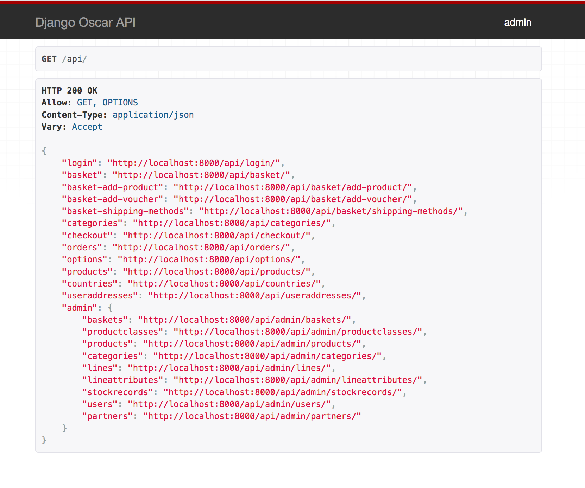

=============
The Admin API
=============
The endpoints which Oscar API exposes by default are mostly suitable for checkout. In other words: For customers who want to buy a product from your webshop. From Oscar API version 1.6 and upwards, an *Admin API* is also available and exposed. Some usecases for the *Admin API* are:

* Creating your own admin frontend application and use Oscar as the backend (managing your catalogue, partners etc)
* Use Oscar with the *Admin API* as a SAAS solution: let other developers and companies integrate Oscar with their products
* *Push synchronization* of stockrecords / products / categories / partners  instead of import scripts etc.

.. note::
  To enable the Admin API, you must first set ``OSCARAPI_BLOCK_ADMIN_API_ACCESS`` to ``False`` in your settings file.

To gain access to the *Admin API* you will beed to be a staff user (``IsAdminUser`` in `DRF`_). The ``APIAdminPermission`` (see also :ref:`permissions-label`) is used to grant access to the different models in the *Admin API* and what you can do with them. So if you only have the *view* and *edit permissions* for the ``Product`` model you are only allowed to view and edit products. To delete products you need the *delete* permission as well.

Default this permission is inherited from `DjangoModelPermissions`_ with the addition that it respects the *view* permissions as well. You can customize this as described in :doc:`/topics/customizing_oscarapi`.

.. _`DRF`: https://www.django-rest-framework.org/
.. _`DjangoModelPermissions`: https://www.django-rest-framework.org/api-guide/permissions/#djangomodelpermissions

The *Admin API* is also accessible in the browsable API when your logged in user has access to it. Here you can also test and see how to use the *Admin API*. Some sophisticated code has been added to make this API pretty straightforward and easy to use.

Example: add an image
---------------------

To add an image to an existing product and change nothing else, it is best to use
the ``PATCH`` http method. This will let you send partial information to
the API, and update only what is being sent.

There are two methods to update an existing product, depending on whether you
know the current API url or you only know the product ``upc``.

Suppose we know the full url then it can be done like this::

    session.post(
        "http://127.0.0.1:8000/oscarapi/admin/products/1/",
        json={
            "images": [{
                "original": "http://permanentmarkers.nl/images/logo.png",
                "caption": "hai",
                "display_order": 0
            }]
        }
    )

The API will download the image from that url and add it to the list.

Suppose you don't know the url in the API, you'd have to know some unique attribute,
for example, the UPC. You can just use the product list API and if you send
enough data to uniquely identify the product, it will succeed::

    session.post(
        "http://127.0.0.1:8000/oscarapi/admin/products/",
        json={
            "upc": "1_5_1",
            "images": [{
                "original": "http://permanentmarkers.nl/images/logo.png",
                "caption": "hai",
                "display_order": 0
            }]
        }
    )

That will also work, you can even try to paste the bodies into the browsable
html API and it will update your product and add the image. The second method
makes the APO very suitable for integration with external parties, you can just
send updates and forget about it, no need to search for the product first or
whatever.

An optimization
---------------

Suppose you want to integrate with an external system and want to send you data
in a fire and forget way. If you have a lot of images, the API will need to
download the images every time, to check if they are know images or new images
to determine if there is anything to update. That is a lot of useless traffic.

To remedy that, you can send the sha1 hash of the image along with it as a get
parameter. oscarapi will not even try to download it if the image is known::

    session.post(
        "http://127.0.0.1:8000/oscarapi/admin/products/",
        json={
            "upc": "1_5_1",
            "images": [{
                "original": "http://permanentmarkers.nl/images/logo.png?sha1=751499a82438277cb3cfb5db268bd41696739b3b",
                "caption": "hai",
                "display_order": 0
            }]
        }
    )
