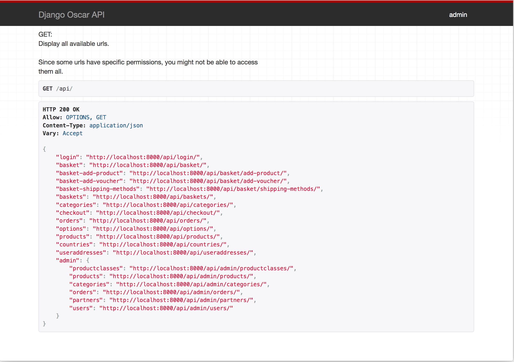

=============
The Admin API
=============
The endpoints which Oscar API exposes by default are mostly suitable for checkout. In other words: For customers who want to buy a product from your webshop. From Oscar API version 1.6 and upwards, an *Admin API* is also available and exposed. Some usecases for the *Admin API* are:

* Creating your own admin frontend application and use Oscar as the backend (managing your catalogue, partners etc)
* Use Oscar with the *Admin API* as a SAAS solution: let other developers and companies integrate Oscar with their products
* *Push synchronization* of stockrecords / products / categories / partners  instead of import scripts etc.

..note::
  To enable the admin api, you must first set ``OSCARAPI_BLOCK_ADMIN_API_ACCESS`` to ``False`` in your settings file,
  otherwise you will not be able to log in to the api as a staff/superuser.

To gain access to the *Admin API* you will beed to be a staff user (``IsAdminUser`` in `DRF`_). The ``APIAdminPermission`` (see also :ref:`permissions-label`) is used to grant access to the different models in the *Admin API* and what you can do with them. So if you only have the *view* and *edit permissions* for the ``Product`` model you are only allowed to view and edit products. To delete products you need the *delete* permission as well.

Default this permission is inherited from `DjangoModelPermissions`_ with the addition that it respects the *view* permissions as well. You can customize this as described in :doc:`/usage/customizing_oscarapi`.

.. _`DRF`: https://www.django-rest-framework.org/
.. _`DjangoModelPermissions`: https://www.django-rest-framework.org/api-guide/permissions/#djangomodelpermissions

The *Admin API* is also accessible in the browsable API when your logged in user has access to it. Here you can also test and see how to use the *Admin API*. Some sophisticated code has been added to make this API pretty straightforward and easy to use.

